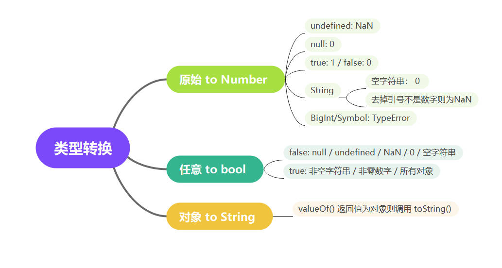

## 数据类型相关

- 基本类型：Number, String, Boolean, Symbol, BigInt, null, undefined
- 引用类型：Object(Array, Set, Map...), Function

**二者区别**：

- 基本类型：按值访问，直接存储在栈内存之中，值的复制是直接创建一个副本。
- 引用类型：按引用访问，数据存储在堆内存之中，栈内存中存储的是指向堆内存的指针。复制时只是复制了引用，而不是对象本身，当一个对象被多个变量引用时，修改其中一个变量的值会影响其他变量。

### null 与 undefined

1. `null` 可以理解为: 对象不存在. 当某个方法返回值是一个对象，但对象不存在时返回的就是 `null`.

例如: `document.querySelector()`返回的是 DOM 对象，当没有查询到时返回的就是 `null`.

2.  `undefined` 可以理解为: 缺少值.

    - 变量定义了但是没有赋值
    - 访问对象中不存在的属性
    - 函数没有返回值时的默认值

### 弱等于和强等于

- 弱等于 `==`：只进行值比较，在比较时会先进行类型转换。
- 强等于 `===`: 先进行类型判断，如果类型不同，直接返回 false，如果类型相同，再进行值的比较。
- `Object.is()`: 主要用于处理 `NaN` 和 `+0/-0` 的特殊情况。

一般情况下 `NaN==NaN` 会返回 `false`, `+0==-0` 会返回 `true`, 而 `Object.is(NaN,NaN)` 会返回 `true`, `Object.is(+0,-0)` 会返回 `false`.

### 类型转换规则

发生类型转换的情况：

1. 加减乘除运算：`+` 运算符会进行字符串拼接，而其他的运算符都会进行数值转换。
2. 弱等于 `==` 运算符：会进行类型转换再进行比较。
3. `if` 语句：会进行布尔值转换。
4. 强制类型转换：`Number()`、`String()`、`Boolean()`等等。



### 判断数据类型的方法

1. `typeof`：只能用于判断**基本类型与函数**，对于其他任何对象都会返回 `object`。
2. `instanceof`：通常用于判断**对象**的具体类型，例如 `arr instanceof Array`。其原理是检测构造函数的 `prototype` 属性是否出现在某个实例对象的原型链上。
3. `Object.prototype.toString.call()`：通用的判断方法，可以判断任何类型的数据。

### const / let / var

- `var`：声明的变量会被提升到**函数作用域**的顶部，如果没有声明函数作用域，那么会被提升到全局作用域的顶部。**可以重复声明**。
- `let & const`：声明的变量会被提升到**块级作用域**的顶部，但是存在**暂时性死区**。不可以重复声明。区别是 `let` 可以修改值，`const` 不可以修改值。

:::code-group

```js [var 变量提升]
function test() {
  console.log(a); // undefined
  var a = 1;
  console.log(a); // 1
}
// 以上代码与以下代码等价

function test() {
  var a;
  console.log(a); // undefined
  a = 1;
  console.log(a); // 1
}
```

```js [const/let 变量提升]
// 存在变量提升，但也存在暂时性死区。
function test() {
  console.log(a); // ReferenceError: Cannot access 'a' before initialization
  let a = 1;
  console.log(a);
}
```

:::

### 词法作用域

在 JavaScript 中具有三种作用域：全局作用域、函数作用域、块级作用域（ES6 新增，通过一对花括号或代码块定义）。如果一个变量或表达式不在当前作用域中，那么它就是不可用的。作用域可以堆叠成一个作用域链，当我们访问一个变量时，会先从当前作用域开始查找，如果没有找到，就会去上一级作用域查找，直到找到为止。需要注意的是，**父级作用域无法访问子级作用域的变量**。

## 原型与原型链

在 JavaScript 中，每个构造函数都具有 prototype 属性，它是一个指向原型对象的指针，原型对象上存放着一些公有的方法和属性。

当我们使用构造函数去创建一个对象实例时，这个实例的 `__proto__` 属性就指向了构造函数的 prototype 属性。（我们可以通过 `Object.getprototypeOf()` 方法来获取这个属性）

当我们访问实例的某个属性或者方法时，如果实例本身不存在这个方法或者属性，那么就会去它的 **proto** 属性所指向的原型对象上去查找，如果原型对象上还是不存在，那么就会去原型对象的 **proto** 属性所指向的原型对象上去查找，这样一层一层的查找下去，就形成了原型链。值得一提的是，原型链的终点是 null，它是所有对象的根原型。

根据原型链的这个特性，我们可以实现继承，比如说我们可以让一个构造函数的 prototype 属性指向另一个构造函数的实例，这样一来，这个构造函数的实例就可以访问另一个构造函数的实例上的属性和方法了。

```js
function Person(name, age) {
  (this.name = name), (this.age = age);
}
const tom = new Person("tom", 18);
console.log(tom.__proto__ === Person.prototype); // true
```

例如我们查找一个对象 tom 的属性 tom.phone 的流程如下:

```js
/*
 * tom
 * -> tom.__proto__(即 Person.prototype)
 * -> tom.__proto__.__proto__(即 Function.prototype)
 * -> tom.__proto__.__proto__.__proto__(即 Object.prototype)
 * -> tom.__proto__.__proto__.__proto__.__proto__(即 null)
 */
```

原因是 `tom = new Person()` 时, `tom` 的隐式原型指向了 `Person.prototype`, 而 `Person` 函数是通过 `new Function()` 创建的,所以 `Person.prototype` 的隐式原型指向了 `Function.prototype`,同理 `Function.prototype` 的隐式原型指向了 `Object.prototype`,而 `Object.prototype` 的隐式原型指向了 `null`.

:::info TIP
如果希望只在当前对象上查找属性，而不沿着原型链进行查找，可以使用 `hasOwnProperty()` 方法
:::

## new 一个对象的过程

1. 创建一个空对象 `{}`
2. 将空对象的隐式原型 `_proto_` 指向构造函数的原型 `prototype`（在这一步箭头函数无法完成）
3. 将构造函数的 `this` 指向第一步创建的空对象并调用构造函数。
4. 没有返回对象则返回 `this`

简易实现：

```js
function myNew(constructor, ...args) {
  // 1. 创建新对象
  let obj = {};
  // 2. 设置原型
  Object.setPrototypeOf(obj, constructor.prototype);
  // 3. 绑定 this 执行构造函数
  let result = constructor.apply(obj, args);
  // 4. 返回对象
  return result && typeof result === "object" ? result : obj;
}
```

## 箭头函数与普通函数的区别

首先明确一点,箭头函数引入是为了更简洁的函数以及 `this` 的指向问题

1.  箭头函数的语法更加简单,`()=>{}` 与 `function(){}` 的区别
2.  箭头函数没有自己的 `this`,它的 `this` 是继承外层的 `this`
3.  箭头函数没有原型对象,所以不能作为构造函数.
4.  箭头函数不绑定 `arguments`.

## 内存管理 & 垃圾回收

JavaScript 在创建变量时自动进行了内存的分配，并且在不使用它们时“自动释放”。释放的过程被称之为垃圾回收。内存的生命周期主要包括：分配内存，使用内存和释放内存。我们主要关注释放内存的过程，因为这是内存管理中最容易出现问题的地方。

释放内存的一个难点在于**如何判断一个变量是否还有用**。主要的垃圾回收算法有以下两种：

1. **引用计数法**：当一个对象被引用时，引用计数增加；当一个对象不再被引用时，引用计数减少。当引用计数为 0 时，对象就会被回收。这种算法的缺点是**循环引用**的问题。如果两个或多个对象互相引用，但它们之间不再被其他活跃的对象所引用，它们的引用计数将永远不会达到零，尽管它们已经不再被使用了。这种情况下，引用计数法就会导致内存泄漏。因此，现代浏览器已经不再使用这种算法。
2. **标记清除法**：这种算法是目前主流的垃圾回收算法。它的基本思路是从根对象开始遍历所有的引用，标记所有被引用的对象，然后清除所有未被标记的对象。这种算法的优点是可以处理循环引用的情况。

## 闭包

闭包在 JavaScript 中是作用域与作用域链概念的直接结果。作用域链是指内部作用域能够访问到外部作用域的变量，但外部作用域不能访问内部作用域的变量。闭包发生在函数嵌套的情况下，这样的函数结构创建了作用域链。

闭包的两个主要特性是：

1. **私有变量**：由于外部作用域无法访问内部作用域的变量，闭包可以用来创建私有变量。
2. **维持引用**：闭包中的函数保留了对外部作用域的引用，这意味着外部作用域的变量不会被垃圾回收机制回收，因为它们仍被内部函数引用。

总结来说，闭包与作用域链、垃圾回收紧密相关。它们可以用于实现私有变量、缓存变量等功能。然而，闭包的缺点是可能导致内存泄漏，尤其是当闭包的生命周期较长或者引用了大量数据时。

## 事件循环

## Promise

## 喵喵喵 🐱

### Map 与 WeakMap

- `Map`：键值对集合，可以使用任何类型的值作为键，支持迭代。
- `WeakMap`：键值对集合，键只能是对象，不支持迭代，不会阻止垃圾回收机制回收键。具体而言当键被回收时，对应的值也会被回收。如果是 `Map` 的话，即使键被回收，值也不会被回收。

### for...in... 与 for...of...

- `for...in...`：遍历对象的**可枚举属性**，包括自身属性和继承属性。
  - 当我们使用 `for...in...` 遍历数组时，实际上遍历的是数组的索引。
- `for...of...`：遍历**可迭代对象**的值，例如数组、字符串、Map、Set 等。
  - `for...of...` 无法遍历对象，因为对象不是可迭代对象，除非我们手动实现迭代器。

## TypeScript

### 常见的工具函数

<LinkCard link="https://juejin.cn/post/7084241167696527396" desc="学习Typescript泛型工具函数，看这一篇就够了 | 掘金" />
