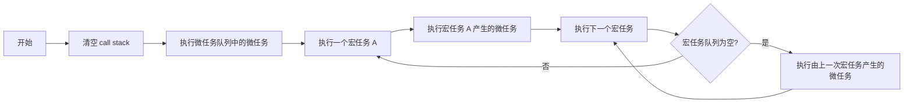

## JavaScript 相关

### 数据类型

- 基本类型：Number , String , Boolean , Symbol , BigInt , null, undefined
- 引用类型：Object( Array , Function... )

#### 区分 null 和 undefined

1. `null` 可以理解为: 对象不存在. 当某个方法返回值是一个对象，但对象不存在时返回的就是 `null`.

例如: `document.querySelector()`返回的是 DOM 对象，当没有查询到时返回的就是 `null`.

2. `undefined` 可以理解为: 缺少值.

- 变量定义了但是没有赋值
- 访问对象中不存在的属性
- 函数没有返回值时的默认值

具体说明可以参考:[JavaScript 数据类型和数据结构 - JavaScript | MDN (mozilla.org)](https://developer.mozilla.org/zh-CN/docs/Web/JavaScript/Data_structures#强制类型转换)

#### 判断数据类型

1. `typeof xxx`可以判断出基本类型的变量（例外:`null`显示为`object`）.

2. `xxx instanceof yyy`可以判断 x 是不是 y (构造函数) 的实例.

> 原理是判断 x 的原型链上是否存在 y 的 prototype
>
> 参考 API 文档: [instanceof - JavaScript | MDN (mozilla.org)](https://developer.mozilla.org/zh-CN/docs/Web/JavaScript/Reference/Operators/instanceof)

3. `Objetc.prototype.toString.call(xxx)` 可以区分不同的引用类型.

结合 1 与 3 可以得到以下代码:

```js
function getType(x) {
  let type = typeof x;
  if (type !== "object") return type;
  type = Object.prototype.toString.call(x).replace(/\[object (\w+)\]/, "$1");
  return type;
}
```

### 深拷贝与浅拷贝

该部分内容可结合 `深浅拷贝.js` 文件配合食用.

- 赋值: 原始类型相互独立，引用类型互相干扰。
- 浅拷贝：引用类型中的原始类型相互独立，但是引用类型任然会受影响.
- 深拷贝: 完全独立.

实现浅拷贝的常见方法: 1. 拓展运算符... ; 2. `Object.assign({},原始对象)`

实现深拷贝的常见方法:

- `JSON.parse(JSON.stringfy(obj))`:缺点是无法识别函数和正则对象.
- 手写深拷贝，利用构造函数开辟新的空间，再递归遍历原始对象去赋值.

```js
function deepClone(obj, hash = new WeakMap()) {
  if (obj == null) return obj;
  if (obj instanceof RegExp) return new RegExp(obj);
  if (obj instanceof Date) return new Date(obj);
  if (typeof obj !== "object") return obj;

  // 防止循环引用
  if (hash.get(obj)) return hash.get(obj);

  let cloneObj = new obj.constructor();
  hash.set(obj, cloneObj);
  for (let key in obj) {
    // 确保只拷贝自身的属性而非继承的属性
    if (obj.hasOwnProperty(key)) cloneObj[key] = deepClone(obj[key], hash);
  }
  return cloneObj;
}
```

## 不知道怎么分类

### cookie / localStorage / sessionStorage

- cookie 的本职工作并非本地存储，而是维持状态，因为 HTTP 协议是无状态的，不会保存客户端与服务器之间的通信状态。
- localStorage 是持久化的本地存储，存储在其中的数据不会过期，除非手动删除，通常用于提升网页首屏渲染速度。
- sessionStorage 是临时性的本地存储，数据仅存在于一次会话（页面）中，关闭页面存储的数据就会被释放。

参考资料：[深入了解浏览器存储--从 cookie 到 WebStorage、IndexedDB - 掘金 (juejin.cn)](https://juejin.cn/post/6844903812092674061)

### 从输入 URL 到页面展现

1. dns 解析获取目标 IP
2. TCP 封装 HTTP 报文，通过三次握手建立 TCP 连接
3. 发送 HTTP 请求
4. 服务器处理请求并返回 HTTP 报文
5. 浏览器进行同源策略的判定
6. 浏览器解析渲染页面

- 根据 HTML 解析出 DOM 树
- 根据 CSS 解析出 CSS 规则树
- 结合 DOM 树和 CSS 规则树，生成渲染树
- 根据渲染树计算每一个结点的信息 => 绘制页面

7. 四次挥手断开 TCP 连接

### 强缓存与协商缓存

#### 强缓存

强缓存的含义是，客户端发送请求时，会先访问缓存数据库，存在就直接返回，否则再向服务器发送请求。

可以造成强缓存的字段是 `cache-control` 和 `Expires`.

**Expires**表示缓存到期的时间，是一个绝对的时间.

```yaml
Expires: Thu, 10 Nov 2017 08:45:11 GMT
```

缺点：

1. 由于是绝对时间，考虑到时差/误差或者客户端自行修改等因素，都会造成客户端与服务器端时间不一致，从而导致缓存失效。

2. 字段表示过于复杂，很容易因为非法属性值从而设置失效

**cache-control** 则是通过设置相对时间来修正 `Expires` 的缺点.

```yaml
Cache-control: max-age=2592000
```

更多常用的字段

- `max-age`：即最大有效时间，在上面的例子中我们可以看到

- `must-revalidate`：如果超过了 `max-age` 的时间，浏览器必须向服务器发送请求，验证资源是否还有效。

- `no-cache`：虽然字面意思是“不要缓存”，但实际上还是要求客户端缓存内容的，只是是否使用这个内容由后续的对比来决定。

- `no-store`: 真正意义上的“不要缓存”。所有内容都不走缓存，包括强制和对比。

- `public`：所有的内容都可以被缓存 (包括客户端和代理服务器， 如 CDN)

- `private`：所有的内容只有客户端才可以缓存，代理服务器不能缓存。默认值。

#### 协商缓存

当强制缓存失效（超过规定时间）时，就需要使用协商缓存，由服务器决定缓存内容是否失效。

大致流程如下：浏览器先请求缓存数据库返回一个缓存标识，随后携带这个缓存标识与浏览器通讯，如果未失效则返回 304 继续使用，否则返回新的数据与缓存规则。

协商缓存具有两组字段：

**Last-Modified & If-Modified-Since**

1. 服务器通过 `Last-Modified` 告知客户端，资源最后一次被修改的时间.
2. 浏览器将这个值和内容一起记录在缓存之中.
3. 下一次请求相同资源而强缓存失效时，会在请求头中设置 `If-Modified-Since` 的值为缓存中记录的 `Last-Modified`.
4. 服务器会将 `If-Modified-Since` 的值与 `Last-Modified` 字段进行对比。如果相等，则表示未修改，响应 304；反之，则表示修改了，响应 200 状态码，并返回数据。

缺陷如下：

- 如果资源更新的速度是秒以下的单位，那么该缓存是无法使用的。
- 如果文件是通过服务器动态生成的，那么该方法的更新时间永远是生成的时间，尽管文件可能并没有改变，但仍然会被认为改变了。

**Etag & If-None-Match**

为了解决上述问题，出现了这一组新的字段。

`Etag`存储文件的特殊标识（通常由 hash 生成），流程基本一致。

#### 小结

如果有强制缓存且未失效，则使用强制缓存，不请求服务器，状态码均为 200.

如果有强制缓存但已失效，则使用协商缓存，比较 时间 或 Etag 确定是 304 还是 200.

## CSS 相关

### 绘制三角形

借助 `border` 的宽度以及 `transparent`透明色

```css
.box {
  width: 200px;
  height: 200px;
  box-sizing: border-box;
  border-top: 200px solid blue;
  border-right: 200px solid transparent;
}
```

### 文本溢出

**单行文本溢出**

```css
/* 强制单行显示 */
white-space: nowrap;
/* 溢出部分隐藏 */
overflow: hidden;
/* 超出部分用省略号替代 */
text-overflow: ellipsis;
```

**多行溢出**

```css
div {
  height: 80px; // 高度要设置得合理，或者不设置
  overflow: hidden;
  text-overflow: ellipsis;
  display: -webkit-box;
  -webkit-line-clamp: 4;
  -webkit-box-orient: vertical;
}
```

### 清除浮动

1. 给父元素添加 `overflow:hidden`
2. 给父元素设置伪元素

```css
.clearfix:after {
  content: "";
  display: block;
  height: 0;
  clear: both;
  visibility: hidden;
}
/* 由于IE6-7不支持:after，使用 zoom:1触发 hasLayout。 */
.clearfix {
  *zoom: 1;
}
```

### 响应式布局

1. 媒体查询

```css
@media screen and(max-width:500px) {
  body {
    ...;
  }
  /*样式相关*/
}
```

2. 利用相对单位 rem / 百分比 / vieport ，可以利用 js 动态计算 rem 的值

### opacity / visibility / display 元素隐藏

- `opacity:0` 占据空间，可以点击，可以设置过渡动画，（既不回流也不重绘，触发的是 CSS3 硬件加速）

> CSS3 硬件加速通过将特定的 CSS 属性应用于元素，例如`transform`、`opacity`、`filter`等，浏览器会将这些元素的渲染和动画操作交给 GPU 来处理，从而提高性能和流畅度。

- `visibility:hidden`占据空间，不可点击，（触发重绘）
- `display:none` 不占据空间，会导致页面回流

### 回流与重绘

回流： 对 DOM 的修改引发了 DOM 几何尺寸的改变。

重绘： 对 DOM 的修改导致了样式的变化而尺寸没变。

回流一定引发重绘，重绘不一定引发回流。

参考文档：[你不知道的浏览器页面渲染机制 - 掘金 (juejin.cn)](https://juejin.cn/post/6844903815758479374?searchId=202307221136419F779DBC144D253DB3E5)

## 跨域

**同源策略三要素**: 协议 ， 域名 ， 端口

跨域问题仅发生在浏览器之中，浏览器向服务器发起请求，服务器正常响应，浏览器收到响应报文后进行跨域校验。

处理跨域的三种方式: JSONP , CORS , 代理

1. `JSONP`: 利用`<script>`标签的 src 属性发起跨域请求，浏览器需要返回一段类似 `handleResponse({ "name": "John", "age": 25 });` 的 js 代码，其中 `handleResponse` 为前端编写的回调函数，中间的参数为响应的数据。
2. `CORS`：服务端设置响应头:

   - `Access-Control-Allow-Origin`
   - `Access-Control-Max-Age`
   - `Access-Control-Allow-Methods`
   - `Access-Control-Allow-Headers`
   - `Access-Control-Allow-Credentials`

3. 代理： 由于跨域问题只发生在浏览器，可以考虑利用一个同源的代理服务器进行请求转发。

## 事件循环

**执行顺序**：1. 从上到下一行一行执行. 2. 先执行同步代码，再执行异步代码. 3. 如果报错则停止执行后续代码.

异步代码又分为：

- 宏任务: `setTimeout` , `setInterval`, Ajax 等等由浏览器发起的（）
- 微任务: `Promise`的回调函数(Promise 本身是同步的)，`async / await`

事件循环流程：

1. 清空 call stack 中的同步代码
2. 执行微任务队列中的微任务
3. 执行一个宏任务 A
4. 执行由宏任务 A 产生的所有微任务
5. 执行下一个宏任务...
6. 所有宏任务执行完毕后，再执行由 A 产生的宏任务.



## 词法作用域

1. 函数外部无法访问函数内部定义的变量
2. 在嵌套函数中，内部函数可以访问外部函数的变量，外部函数不能访问内部函数的变量。
3. 相同作用域中的同名变量，内部变量会覆盖外部变量

## this 指向

1. 全局作用域中, this 指向全局对象.
2. 在函数之中, this 的指向取决于函数的调用方式
   1. 如果函数作为对象的方法被调用， this 指向调用该方法的对象.
   2. 如果函数使用 call / bind/ apply 进行调用,this 指向作为参数传递的对象.
   3. 如果函数使用 new 关键字调用, this 指向新创建的实例对象.
   4. 如果函数被直接调用，则 this 指向全局对象(严格模式下为 undefined)

## 登录鉴权

## 权限路由

## 防抖节流

## 虚拟滚动和无限滚动

## 性能优化 lighthouse

## HTTP 与 HTTPS

**HTTP 存在的问题**

1. HTTP 采用明文传输，内容可能被窃听.
2. 无法证明报文的完整性，可能遭遇篡改.
3. 不验证通信方的身份，有可能遭遇伪装.

**HTTPS 工作流程**


通信过程可以分为两个阶段： TLS 握手阶段和数据传输阶段.

在 TLS 握手阶段，通过非对称加密算法来实现身份验证 (数字证书) 和密钥交换.

在数据传输阶段, 使用对称加密算法加密通信内容，同时使用某种算法生成数字签名用于校验内容的完整性.

**非对称加密简述:**公钥用于加密，私钥用于解密，两个密钥是相关联的，但是无法从一个推导出另一个.

## 计网

### TCP 四次挥手

> A: FIN
>
> B: ACK
>
> B: FIN
>
> A: ACK
>
> 四次原因：服务端可能还有数据没有发送完，需要四次挥手来保证双方数据的完整性.
