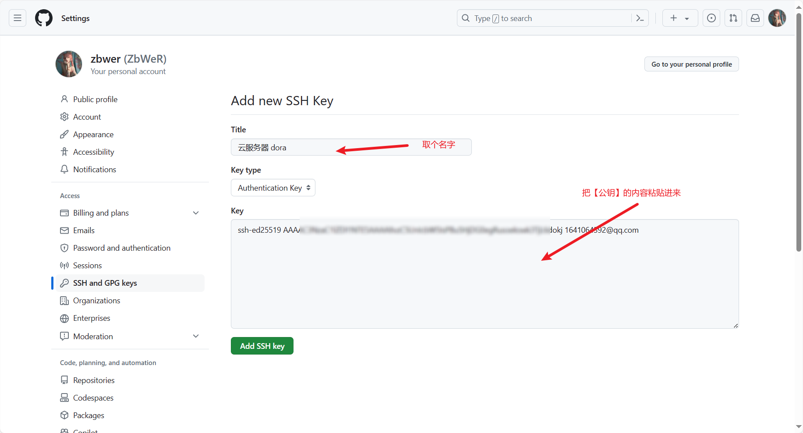
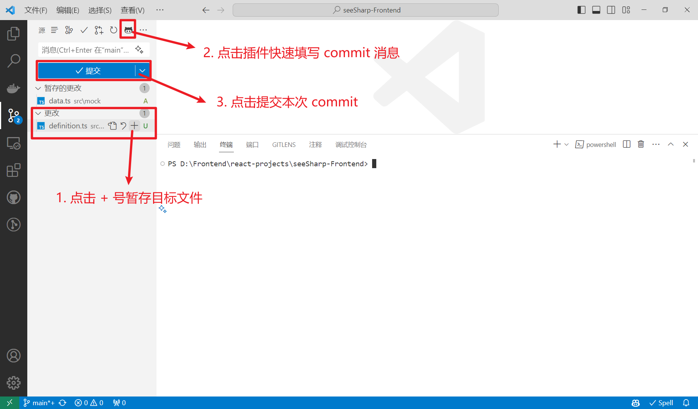

## 📦 安装

下载地址：[Git Downloads](https://git-scm.com/downloads)，请根据自己的操作系统与机器型号选择正确的版本。

安装后，可以通过以下步骤验证是否安装成功（如果您使用的是 win 操作系统）：

1. 按下 `Win + R` 输入 `cmd` 打开终端。
2. 在终端中运行 `git --version`，如果显示出版本信息，则说明安装成功 🎉。

## 🔒 身份认证

该步骤将进行身份认证的配置，以便后续拉取与 Github 上的代码。

👉 官方文档：[关于 SSH - GitHub 文档](https://github.com/settings/keys)

#### 1. 生成 ssh 密钥

请在终端中运行以下命令：

```bash
ssh-keygen -t ed25519 -C "your_email@example.com"
```

你将看到如下信息（注：# 后的文本是注解，并不会在终端显示）：

```
Generating public/private ed25519 key pair.
# 输入 ssh 密钥的保存路径，初次使用时建议保持默认
Enter file in which to save the key (/root/.ssh/id_ed25519):
# 输入该密钥的密码，可以直接回车
Enter passphrase (empty for no passphrase):
Enter same passphrase again:
```

完成后，你的识别信息将被保存在 `/root/.ssh/id_ed25519`，公钥则保存在 `/root/.ssh/id_ed25519.pub`。

#### 2. 启动 ssh 代理并添加私钥

启动 ssh 代理并添加私钥的命令如下：

```bash
eval "$(ssh-agent -s)"    # 该命令运行成功会显示：Agent pid xxx
ssh-add ~/.ssh/id_ed25519 # 如果你在生成密钥时自定义了名称，记得在此处修改
```

#### 3. 将公钥添加到 Github 上

访问 [GitHub SSH keys settings](https://github.com/settings/keys)，点击 "New SSH key"。



#### 4. 测试连接

运行以下命令测试与 Github 的连接：

```bash
ssh -T git@github.com
```

如果成功，你将看到以下内容，出错请自行排查 💤：

```
The authenticity of host 'github.com (20.205.243.166)' can't be established.
ECDSA key fingerprint is SHA256:p2QAMXNIC1TJYWeIOttrVc98/R1BUFWu3/LiyKgUfQM.
Are you sure you want to continue connecting (yes/no/[fingerprint])? yes
Warning: Permanently added 'github.com,20.205.243.166' (ECDSA) to the list of known hosts.
Hi ZbWeR! You've successfully authenticated, but GitHub does not provide shell access.
```

#### 拉取代码

使用以下命令拉取代码到本地：

```bash
git clone git@github.com:ZbWeR/xxx.git
```

## 🛠️ VSCode 插件推荐

1. **GitLens**：悬停提示了解代码的更改及其作者，使用用户友好的编辑器可视化和配置交互式变基操作等等。
2. **Git-commit-plugin**：快速生成符合规范的 commit 信息。

## 基本操作

- 查看 Git 配置：`git config --list`
- Git 配置用户身份：
  ```bash
  git config --global user.name "xxx"
  git config --global user.email "xxx"
  ```
- 克隆远程仓库：`git clone <url>`
- 单行查看 commit 日志：`git log --oneline`
- 从远程仓库拉取代码：`git pull` 或者 `git fetch` + `git rebase`
- 推送到远程仓库：`git push`

## VSCode 可视化操作



## 缓存操作

- 保存工作目录的修改：`git stash`
- 恢复工作目录的修改：`git stash pop`
- 查看缓存修改：`git stash list`

## 分支操作

- 本地创建分支：`git checkout -b your_dev_name`
- 上传远程服务：`git push origin your_dev_name`
- 本地删除分支：`git branch -d your_dev_name`
- 删除远程分支：`git push origin --delete <branch_name>`
- 合并多个 commit：`git rebase -i HEAD~<num>`

## 🏃‍♂️ 情景模拟

注意：该情景模拟建立在使用 rebase 作为更新手段的标准下。

#### 1. 新建分支进行开发

你刚刚拿到一个项目，你需要新建一个分支进行开发

```bash
# 克隆项目到本地
git clone <url>
# 创建并切换到一个新的开发分支进行开发
git checkout -b your_dev_name
```

#### 2. 提交代码到远程仓库并合入主分支

你的代码开发完毕，需要提交代码到远程仓库并合入主分支。

建议通过 VSCode 完成基本的暂存提交等操作，此处省略命令行操作，下面命令假设你已经完成了本地的 Commit：

```bash
# 切换到主分支
git checkout master
# 拉取远程分支最新提交
git pull
# 切换到开发分支
git checkout your_dev_name
# 合并远程主分支最新提交到当前开发分支
# 如果出现冲突则在 VSCode 中手动处理
git rebase master
# 推送到远程仓库
git push
```

#### 3. 紧急 bug 修复

你的代码开发到一半，但是突然有紧急 bug 需要修复 🚨

```bash
# 暂存当前分支的修改
git stash
# 切换到主分支，更新代码并新建分支
git checkout master
git pull
git checkout -b fix/xxx
# 进行 bug 修改，推送到远程仓库
# ...
# 切换到主分支，更新代码并返回原开发分支
git checkout master
git pull
git checkout your_dev_name
# 合并主分支更改并回复暂存的更改
git rebase master
git stash pop
```

#### 4.压缩 Commit 美化提交记录

你的开发分支有很多次提交，有的时候（例如公司规范）需要压缩成一个提交。

```bash
# 选择需要压缩的提交
git rebase -i HEAD~<num>
# 在 VSCode 中选择需要保留的提交
# 保存退出后会自动合并提交, 随后处理冲突
# 如果你的分支已经推送到远程仓库，需要强制推送
git push -f
```

#### 5. Code Review 存在问题需要修改

你的代码提交到远程仓库提交了 Pull Request ，在进行 Code Review 时发现了问题，需要修改。

```bash
git add .
git commit --amend
git push -f
```